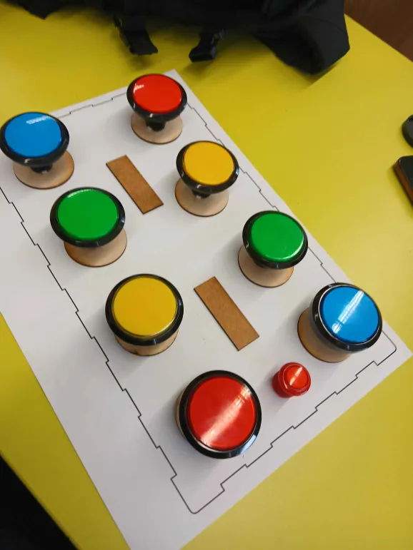

# Verkefni4

## **Spil concept** (Pitch-Perfect)
### **4** takkar fyrir hvern leikmann. Það eru tveir leikmenn.
Takkarnir lýsast upp með fjórum öðruvísi pitch/hljóðum.
Báðir leikmenn hafa 30 sekóndu klukku sem telur niður.

Þegar leikmaðurinn ýtir á réttan takka þá pásast klukkan og klukkan hjá hinum leikmanninum byrjar.
Ef þú ýtir á vitlausan takka, þá tapar þú 3 sekundum.

Eftir tvær umferðrir (4 takkar í heild), þá hættir ljósið að blikka og leikmenn verða að ýta á réttan takka miðað við hljóðið.

progress 
