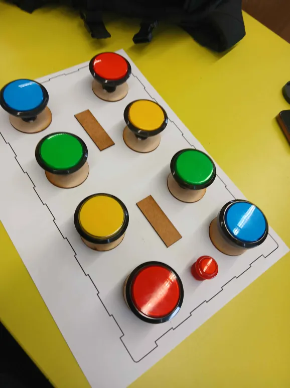
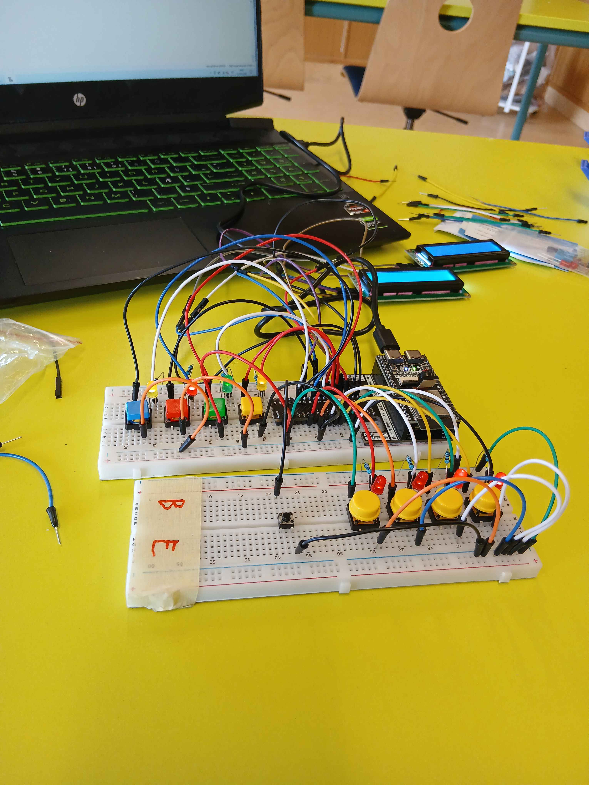
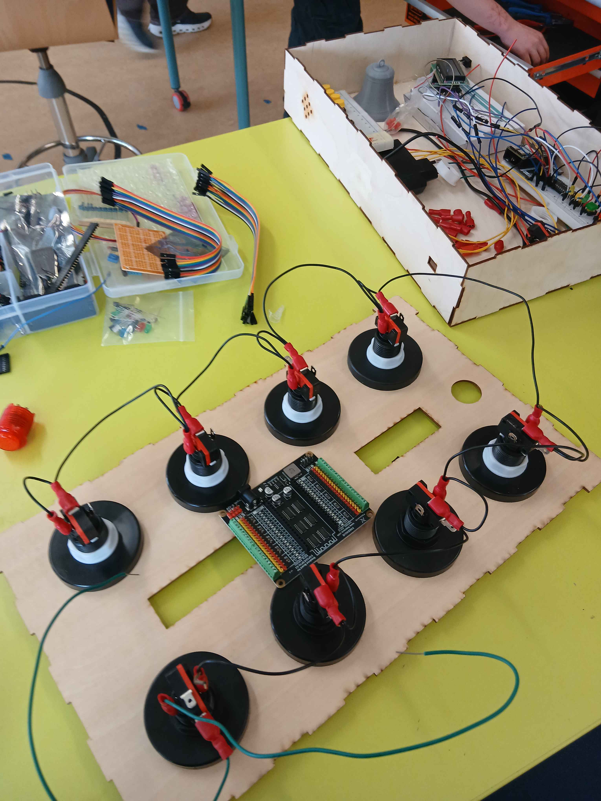

# Verkefni4

## **Spil concept** (Pitch-Perfect)
### **4** takkar fyrir hvern leikmann. Það eru tveir leikmenn.
Takkarnir lýsast upp með fjórum öðruvísi pitch/hljóðum.
Báðir leikmenn hafa 30 sekóndu klukku sem telur niður þegar að þeir eiga að gera.

Þegar leikmaðurinn ýtir á réttan takka þá pásast klukkan þeirra og klukkan hjá hinum leikmanninum byrjar.
Ef þú ýtir á vitlausan takka, þá tapar þú 3 sekundum.

~~Eftir tvær umferðrir (4 takkar í heild), þá hættir ljósið að blikka og leikmenn verða að ýta á réttan takka miðað við hljóðið~~ Ekki nógu mikill tími til að gera

<!---  --->

<!---  --->

<!---  --->

https://github.com/user-attachments/assets/0c0fdb8b-b47f-4ff2-af42-3ea95ff234e5
